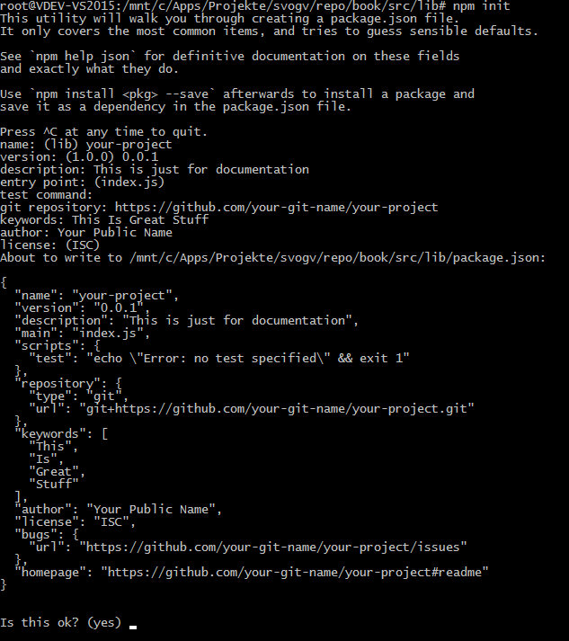
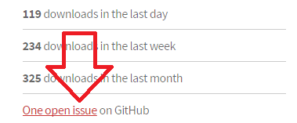
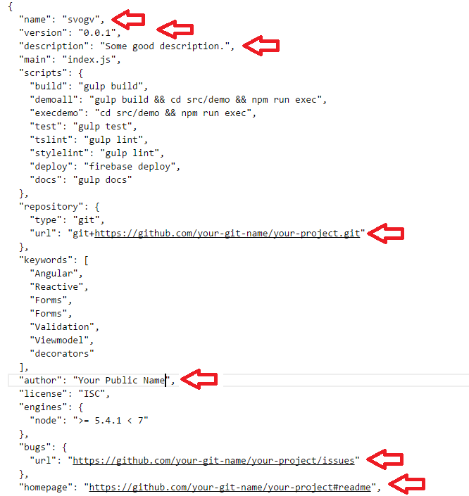
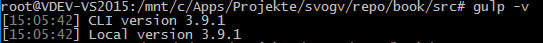

## Create an NPM package

While we host the whole development project on Github the NPM package shall contain just that part a potential user will use.
Hence, we have to create a folder structure that supports this. A good structure would look like this:

    \src  
    \test
    \dist
    \docs
    \guides

    \node_modules\
    \scripts
    \tools

The first block is the working part, here is where you write your project's code. The second block is the supporting infrastructure and
depends on what you really need and want. Usually the code in here is either from an external repository (*node_modules*) or is being
created one time and than just invokes tasks once needed.

The working part consists has two special folders: *\docs* and *\guides*. As you may know is a good documentation the foundation of your
whole project. Without the docs everything has less value. The documentation shall support two parts. Those who want to learn about the 
project before making a decision to give it a try. And those who actively work with the code. In my project I have splittet the two parts
accordingly. The reason is not necessarily the ability to split the documentation. It's because Github has a distinct support for such
texts and I want to make use of it. The first folder we're looking into is *\docs*. This is where this very text resides.

Read about [Github Pages and Markdown](./documentation/documentation) to get a head start.

### Setup the Sources

You probably want to start with a "real" project and take care about the supporting stuff later. That's fine. So let's first setup what we need
at least to get things into NPM. For my project it's sort of a library. So I create a folder *\lib*:

    \src\lib

Because a library needs a lot of testing I am lazy writing plain text a demo app is a good choice. That resides in another folder:

    \src\demo

The pure package is in *\src\lib*. This is what you get when pulling the package from NPM. Everything else is on Github and the user who wants
more must go there. That's why we need the README files. It's all about pointing quickly to the right folders.

#### Initialize the Package

Now once you in the *\lib* folder you can start creating your project. Open a command prompt and enter this:

~~~
npm init
~~~

It's an interactive quest:

There are few things you need to think about before you start:

* Name of the project (in lower case only -- NPM does not allow upper case characters)
* License (such as ISC, MIT, or Apache)
* Description (this will appear very prominently on NPM)
* Keywords (in case you care about new users)

This will create a new file *package.json*. It's more or less the center of your app. It's where all commands you can start come from. 

The final file in my project looks like this:

~~~
{
  "name": "svogv",
  "version": "0.3.5",
  "description": "An advanced set of Angular 4 (Angular2) widgets and model driven forms support.",
  "main": "./bundles/svogv.umd.js",
  "module": "./index.js",
  "typings": "./index.d.ts",
  "repository": {
    "type": "git",
    "url": "https://github.com/joergkrause/svogv.git"
  },
  "keywords": [
    "angular",
    "angular2",
    "angular4",
    "Reactive",
    "Forms",
    "Validation",
    "Viewmodel",
    "decorators",
    "components"
  ],
  "license": "ICS",
  "bugs": {
    "url": "https://github.com/joergkrause/svogv/issues"
  },
  "homepage": "https://github.com/joergkrause/svogv#readme",
  "peerDependencies": {
    "@angular/common": "^2.2.0",
    "@angular/compiler": "^2.2.0",
    "@angular/core": "^2.2.0",
    "@angular/forms": "^2.2.0",
    "@angular/http": "^2.2.0",
    "@angular/platform-browser": "^2.2.0",
    "@angular/platform-browser-dynamic": "^2.2.0",
    "@angular/router": "^3.1.0",
    "core-js": "^2.4.1",
    "rxjs": "^5.4.2",
    "systemjs": "^0.19.38",
    "zone.js": "^0.8.16"
  }
}
~~~

If you now compare this with yours you find that some parts are missing. Let's dive into *package.json* first to get what's important. There are few 
options that simply help others to navigate in your project. These parts are:

  "bugs": {
    "url": "https://github.com/joergkrause/svogv/issues"
  },
  "homepage": "https://github.com/joergkrause/svogv#readme",

They are just pointers to the repository. NPM will extract the values and use this to create links:

Fortunatly, if your repository already exists, the paths are right where they shall be. 

Another part is not yet missing: the dependencies. This part we develop while creating the project. So leave it empty right now. 

#### The Project's Core files

The project we create is an Angular 2 library, created with TypeScript. So we need to setup this properly. The files we need are:

* README.md: 
    
    The documentation's entry point. This file is shown on NPM (not on GitHub). It's sort of your homepage. Remember that we're currently in the *\src\lib\* folder and create just the library. The Github's readme will come later.  

* tsconfig.json:

    The configuration for the TypeScript transpiler. That's covered in the chapter about [TypeScript](./typescript/intro).

* typedoc.json:

    The configuration for the API documentation generator. That's covered in the chapter about [API Documentation](./documentation/api-doc).

* Two files are just for testing. That's covered in the chapter about unit testing:
    * system-config-spec.ts
    * tsconfig-srcs.json

Before you can proceed we need to setup a basic build tool chain. The build process is not part of the library nor the demo we write. It's our personal
effort to assure things go well for our users. That happens in the main (root) folder of the project.

You remember the folder structure we started with? 

  \root
    \src
      \lib
      \demo
    \node_modules
    \scripts
    \test
    \tools

The part in *\src\lib* is almost done. Now we go to the root folder and setup the build tool chain. We use these tools here:

* Gulp: An script runner to automate tasks
* TypeScript: The transpiler from TS in JS
* Sass: Transpiler for SCSS files into CSS
* Travis: A continuees integration tool to monitor the builds
* Karma: Unit Tests for JavaScript

### Setup the Core

There are two ways to setup a project. You can use *npm* and the command line to execute all parts one by one. Or you can create a file named *package.json* and
let the *npm* tool request all dependencies. Because of the sheer amount of tools we usually need the second way is now way better. So, start by putting this file
in your root folder:

~~~
{
  "name": "your-project",
  "version": "0.0.1",
  "description": "Some good description.",
  "main": "index.js",
  "scripts": {
    "build": "gulp build",
    "demoall": "gulp build && cd src/demo && npm run exec",
    "execdemo": "cd src/demo && npm run exec",
    "test": "gulp test",
    "tslint": "gulp lint",
    "stylelint": "gulp lint",
    "deploy": "firebase deploy",
    "docs": "gulp docs"
  },
  "repository": {
    "type": "git",
    "url": "git+https://github.com/your-git-name/your-project.git"
  },
  "keywords": [
    "Angular",
    "Reactive",
    "Forms",
    "Forms",
    "Validation",
    "Viewmodel",
    "decorators"
  ],
  "author": "Your Public Name",
  "license": "ISC",
  "engines": {
    "node": ">= 5.4.1 < 7"
  },
  "bugs": {
    "url": "https://github.com/your-git-name/your-project/issues"
  },
  "homepage": "https://github.com/your-git-name/your-project#readme",
  "dependencies": {
    "@angular/common": "^2.2.0",
    "@angular/compiler": "^2.2.0",
    "@angular/core": "^2.2.0",
    "@angular/forms": "^2.2.0",
    "@angular/http": "^2.2.0",
    "@angular/platform-browser": "^2.2.0",
    "core-js": "^2.4.1",
    "rxjs": "^5.0.1",
    "systemjs": "0.19.38",
    "zone.js": "^0.7.2"
  },
  "devDependencies": {
    "@angular/compiler-cli": "^2.2.0",
    "@angular/platform-browser-dynamic": "^2.2.0",
    "@angular/platform-server": "^2.2.0",
    "@angular/router": "^3.2.0",
    "@types/glob": "^5.0.29",
    "@types/gulp": "^3.8.29",
    "@types/hammerjs": "^2.0.30",
    "@types/jasmine": "^2.2.31",
    "@types/merge2": "0.0.28",
    "@types/minimist": "^1.1.28",
    "@types/node": "^6.0.34",
    "@types/protractor": "^4.0.0",
    "@types/run-sequence": "0.0.27",
    "@types/rx": "^4.1.1",
    "@types/selenium-webdriver": "2.53.36",
    "axe-core": "^2.0.7",
    "axe-webdriverjs": "^0.5.0",
    "conventional-changelog": "^1.1.0",
    "dgeni": "^0.4.2",
    "dgeni-packages": "^0.16.2",
    "express": "^4.14.0",
    "firebase-tools": "^3.2.1",
    "fs-extra": "^1.0.0",
    "glob": "^7.1.1",
    "gulp": "^3.9.1",
    "gulp-autoprefixer": "^3.1.1",
    "gulp-better-rollup": "^1.0.2",
    "gulp-clean": "^0.3.2",
    "gulp-clean-css": "^2.3.0",
    "gulp-cli": "^1.2.2",
    "gulp-connect": "^5.0.0",
    "gulp-htmlmin": "^3.0.0",
    "gulp-if": "^2.0.2",
    "gulp-markdown": "^1.2.0",
    "gulp-sass": "^3.1.0",
    "gulp-shell": "^0.5.2",
    "gulp-sourcemaps": "^2.2.3",
    "gulp-transform": "^1.1.0",
    "gulp-typescript": "^3.1.4",
    "highlight.js": "^9.9.0",
    "jasmine-core": "^2.4.1",
    "karma": "^1.1.1",
    "karma-browserstack-launcher": "^1.0.1",
    "karma-chrome-launcher": "^2.0.0",
    "karma-firefox-launcher": "^1.0.0",
    "karma-jasmine": "^1.0.2",
    "karma-sauce-launcher": "^1.0.0",
    "madge": "^0.6.0",
    "merge2": "^1.0.2",
    "minimist": "^1.2.0",
    "node-sass": "^4.2.0",
    "protractor": "^4.0.8",
    "resolve-bin": "^0.4.0",
    "run-sequence": "^1.2.2",
    "sass": "^0.5.0",
    "selenium-webdriver": "^3.0.0",
    "strip-ansi": "^3.0.0",
    "stylelint": "^7.7.0",
    "symlink-or-copy": "^1.0.1",
    "travis-after-modes": "0.0.6-2",
    "ts-node": "^2.0.0",
    "tslint": "^4.3.1",
    "typedoc": "^0.5.1",
    "typescript": "~2.1.4",
    "which": "^1.2.4"
  }
}
~~~

Remember changing the descriptive parts:

Save this as *package.json* into the root. Open a command prompt and excute this command:

~~~
npm update
~~~

You will have a new folder right now: *node_modules*. There is no need to touch this folder, ever. *npm* will do this for you. First check if Gulp is now
present by typing 

    gulp -v

It should respond like this:

> If you see nothing or just an error that gulp is not yet present [setup Gulp](./setup/setup-gulp) first.

The first part of the setup refers to Gulp. Gulp requires a file called *gulpfile.js* 
to run so called tasks. Because I want use TypeScript my gulpfile is somewhat special:

~~~
'use strict';
/**
 * Load the TypeScript compiler, then load the TypeScript gulpfile which simply loads all
 * the tasks. The tasks are really inside tools/gulp/tasks.
 */

const path = require('path');

// Register TS compilation.
require('ts-node').register({
  project: path.join(__dirname, 'tools/gulp')
});

require('./tools/gulp/gulpfile');
~~~

The `ts-node` is a [TypeScript execution environment](https://www.npmjs.com/package/ts-node) and REPL (Read Execute Print Loop) for node. It's hence sort of an on-the-fly transpiler for TypeScript.
Using this we can write the Gulp stuff in TypeScript and Gulp will still execute plain JavaScript.

### Build tasks

You can build and start everything like this:

* Go to root of the project
  * run `npm run build`: build the library 
  * run `npm run demoall`: build libary, demo, and run the demo using local HTTP server on port 3000
  * run `npm run execdemo`: build and run demo using local HTTP server, but keep library as is
  * run `npm run tslint`: run the linter for the library
* You can run more tasks specific to the demo from there
  * `cd src/demo` and then the particular task 