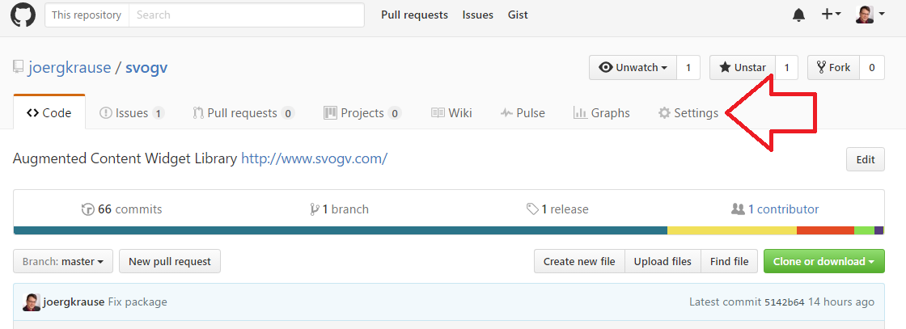
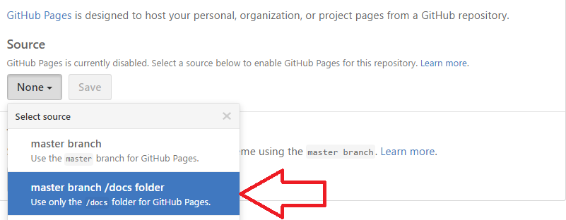

## Create an NPM package

While we host the whole development project on Github the NPM package shall contain just that part a potential user will use.
Hence, we have to create a folder structure that supports this. A good structure would look like this:

\src  
\test
\dist
\docs
\guides

\node_modules\
\scripts
\tools

The first block is the working part, here is where you write your project's code. The second block is the supporting infrastructure and
depends on what you really need and want. Usually the code in here is either from an external repository (*node_modules*) or is being
created one time and than just invokes tasks once needed.

The working part consists has two special folders: *\docs* and *\guides*. As you may know is a good documentation the foundation of your
whole project. Without the docs everything has less value. The documentation shall support two parts. Those who want to learn about the 
project before making a decision to give it a try. And those who actively work with the code. In my project I have splittet the two parts
accordingly. The reason is not necessarily the ability to split the documentation. It's because Github has a distinct support for such
texts and I want to make use of it. The first folder we're looking into is *\docs*. This is where this very text resides.

### Document your Code on Github

NPM packages are just descriptive files that point to a repository. The repository we're talking about is hosted on Github. In the chapter
about Github you learned already to create an account and a repository. For documentation we can use a side project of Github, Github Pages. 
you can find this on [https://github.io/](https://pages.github.com/). To connect to Pages just start in your repository's settings.

Scroll down to the section related to Github Pages, then. Select the folder */docs* in your *master* branch (At the beginning, this is the
only one that exists).

Once setup, you can choose a theme to make the pages distinct. I used the *Midnight* theme and my main page looks like this:

### Writing the content

At the end everything is HTML. Hence, writing in HTML seems the preferred way. But stop for a moment. You probably know a bit or more about
HTML and CSS and all the stuff. It is rather complex for a simple task such as a neat documentation. So there should be an easier way
to achieve this. And this way is called [Markdown](http://daringfireball.net/projects/markdown). Refer to the creator's homepage you get a brief 
introduction:

> Markdown is a text-to-HTML conversion tool for web writers. Markdown allows you to write using an easy-to-read, easy-to-write plain text format, then convert it to structurally valid XHTML (or HTML).

Markdown enables you to write plain text in plain files (remember: our project is all about files and folders). It removes the complexity and
hassle of HTML but keeps the important formatting parts. This very documentation you're currently reading has been written in Markdown. You see,
it has headlines, cites, boxes, images, and even a table is feasible.

Markdown is, of course, free to use. But the very best part of all is, that Github and NPM support Markdown implicitlty. That means, once you upload
a single Markdown file it will be rendered as HTML automatically for users browsing by. No tools, no settings required, nothing else.

#### A Primer into Markdown

While Markdown is well described on the Web and you get countless sources to learn about, I decided to give a brief introduction right here. This
text aims to beginners and browsing the Web here and there is a daunting task. So, let me give you some overview and you can stay with me.

##### Paragraphs, Headings and Blockquotes

A paragraph is simply one or more consecutive lines of text, separated by one or more blank lines. A blank line is just a line break (you hit the ENTER
key to create one). Normal paragraphs should not be indented with spaces or tabs. So, in case you want to create a single paragraph you need to give it 
an empty line before (ENTER), and line break and the end (ENTER) and another line break to create the trailing empty line (ENTER). Apart from this the
content is usually plain text. We come to formatting issues in a while.

Heading can be in two style. First the underline form for first and second level:

    A First Level Header
    ====================

    A Second Level Header
    ---------------------

I rearly use this, because the alternative way is less spacious. It uses # as control character: # for first level, ## for second and so on. The limit
is six # signs, as we have &lth6&gt; as the deepest level in HTML.

    ### Header 3

Blockquotes are indicated using email-style ‘>’ angle brackets. The sign is at the lines first column:

&gt; I'am a blockquote. 

And it appears in HTML like this:

&lt;blockquote&gt;I'am a blockquote&lt;/blockquote&gt;

The actual formatting depends on a theme and this is not part of Markdown.

    > This is a blockquote.
    > 
    > This is the second paragraph in the blockquote.
    >
    > ## This is an H2 in a blockquote

##### Formatting Text

Markdown uses asterisks and underscores to indicate spans of emphasis.

Markdown:

    Some of these words *are emphasized*.
    Some of these words _are emphasized also_.

Use two asterisks or two underlines are used for ** strong emphasis ** or __ use two underscores instead __.

The two characters * and _ avoid the need to escape them in case you need the plain character. At least we can write **bold** and *italics* now.

##### List

Unordered (bulleted) lists use asterisks, pluses, and hyphens (*, +, and -) as list markers. These three markers are interchangable. This looks like this:

    *   NPM.
    *   Bower.
    *   Github.

this:

    +   NPM.
    +   Bower.
    +   Github.

and this:

    -   NPM.
    -   Bower.
    -   Github.

The all create the same output:

&lt;ul>
    &lt;li>NPM.</li>
    &lt;li>Bower.</li>
    &lt;li>Github.</li>
&lt;/ul>

And it looks like this:

*   NPM.
*   Bower.
*   Github.

Ordered (numbered) lists use regular numbers, followed by periods, as list markers:

    1.  Red
    2.  Green
    3.  Blue

Output:

&lt;ol>
    &lt;li>Red</li>
    &lt;li>Green</li>
    &lt;li>Blue</li>
&lt;/ol>

And this is how it actually looks like in my theme:

1.  Red
2.  Green
3.  Blue

If you put blank lines between items, you’ll get 
 tags for the list item text. You can create multi-paragraph list items by indenting the 
paragraphs by four spaces or one tab:

    *   A list item.

        With multiple paragraphs.

    *   Another item in the list.

Output:

<ul>
<li>
A list item.

With multiple paragraphs.
</li>
<li>
Another item in the list.
</li>
</ul>

##### Hyperlinks

Markdown supports two styles for creating hyperlinks: inline and reference. With both styles, you use square brackets to delimit the text you 
want to turn into a link.

Inline-style links use parentheses immediately after the link text. For example:

    Find my [project here](http://www.joergkrause.de/).

The output would look like this:

    &lt;p>Find my <a href="http://www.joergkrause.de/"> project here&lt;/a>.&lt;/p>

Optionally, you may include a title attribute (that creates a tooltip) in the parentheses:

    Find my [project here](http://www.joergkrause.de/ "Joerg's Homepage").

The output is like this:

    &lt;p>Find my <a href="http://www.joergkrause.de/" title="Joerg's Homepage"> project here&lt;/a>.&lt;/p>

Reference-style links allow you to refer to your links by names, which you define elsewhere in your document:

~~~
I get then times more traffic from [Google][1] than from [Yahoo][2] or [MSN][3].

[1]: http://google.com/        "Google"
[2]: http://search.yahoo.com/  "Yahoo Search"
[3]: http://search.msn.com/    "MSN Search"
~~~

Output:

~~~
&lt;p>I get 10 times more traffic from &lt;a href="http://google.com/"
title="Google">Google&lt;/a> than from &lt;a href="http://search.yahoo.com/"
title="Yahoo Search">Yahoo&lt;a> or &lt;a href="http://search.msn.com/"
title="MSN Search">MSN&lt;/a>.&lt;/p>
~~~

The title attribute is optional. Link names may contain letters, numbers and spaces, but are not case sensitive:

    I start my morning with a cup of coffee and [The New York Times][NY Times].

~~~
[ny times]: http://www.nytimes.com/
~~~

##### Images

Image syntax is very much like link syntax. Inline it loosk like this:

~~~

~~~

The title part is optional. Even the description ("Figure...") can be omitted, but not the brackets.

The reference style is available here too:

~~~
![alt text][id]

[id]: /path/to/img.jpg "Title"
~~~

Both of the above examples produce the same output:

~~~
&lt;img src="/path/to/img.jpg" alt="alt text" title="Title" />
~~~

##### Code

As your project is a coding thing your documentation contains code examples. So formating code is crucial. The content is more or less directly translated
into HTML, so be aware of &lt; and &gt; signs. To avoid HTML transformation and write plain code use backticks `. 

~~~
You can use `
` tags almost everywhere.
~~~

That will create this HTML:

~~~
You can use <code>&lt;div&gt,</code> tags almost everywhere.
~~~

For large code blocks just use an encapsulation in the group of ~-signs. You can use any number, eight is recommended for robust environment. I personally
prefer three.

~~~~~
~~~
export class SomeCode {
    // this is nicely formatted
}
~~~
~~~~~

And it appears like this:

~~~
export class SomeCode {
    // this is nicely formatted
}
~~~

