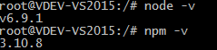
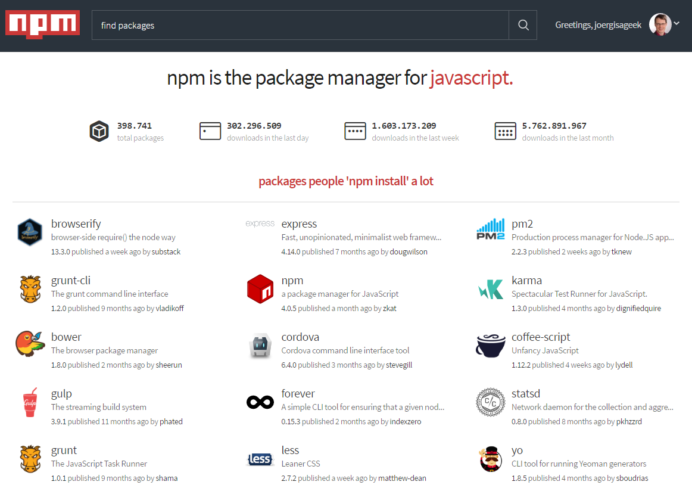
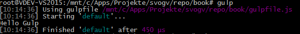
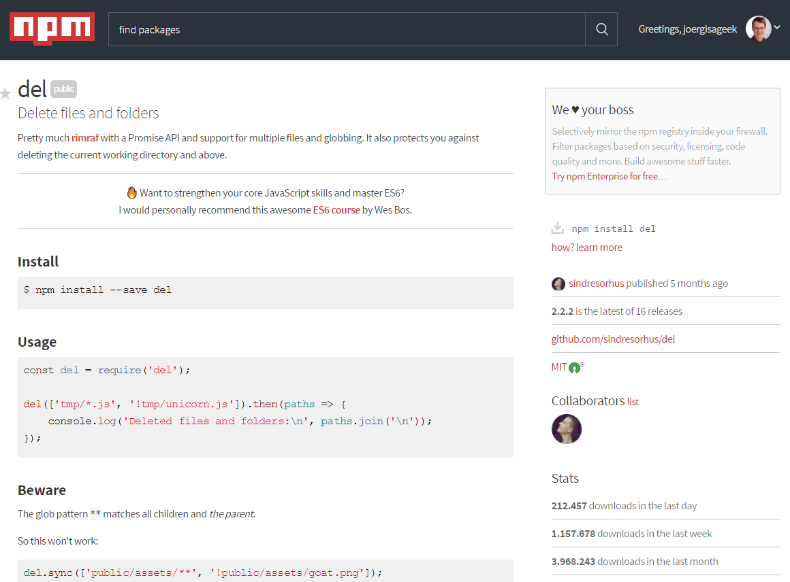
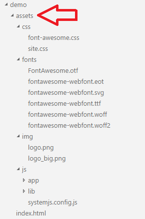

# Setup Gulp

[Gulp](http://gulpjs.com/) comes as a node script and a command line tool (CLI - command line interface). The CLI is just a batch file that executes node in the background. It should be available globally in the command line's path to have it handy once needed.

## What is Gulp for

Let's speak Gulp for itself:

> Automate and enhance your workflow. Gulp is a toolkit for automating painful or time-consuming tasks in your development workflow, so you can stop messing around and build something. [Cite from http://gulpjs.com](http://gulpjs.com/)

And to build something is what you're here for, right?

## Install Gulp

I assume here that you have **node** and hence **npm** up and running. Assure this by opening a command line or terminal and type this:

    node -v

    npm -v

Install **node** first if it's not present. Use at least version 6.x.x. I would currently recommend the LTS (long term support) version for best support and stability. if you struggle with version, take a look at **nvm** -- the Node Version Manager. You can install different versions of **node** on the same machine and use the command `nvm use x.x.x` to select one or another version as the current one. 

Once **node** is up proceed with installing Gulp.

    npm i gulp -g

`i` is short for `install`. 'gulp' is the name of the package. It's being pulled from node package repository **npm**. It can be found right [here](https://www.npmjs.com).

  

> The browser interface is crucial, as it leads to the various packages description, documentation, links to the sources on Github and many other useful links. 

Once Gulp is being installed, you should be able to check this by asking for Gulp's version:

    gulp -v

For beginners I would recommend to skip the TypeScript step first and try to get a simple gulpfile running in plain JavaScript. Open an editor of your choice, create a new file named *gulpfile.js* (and yes, it MUST have exactly this name), and type some code like shown here:

~~~
var gulp = require('gulp');   
gulp.task('default', function(){
    console.log("Hello Gulp");
});
~~~   

Now you can execute this task:

    gulp

It shall result in the following outcome:

Let's examine this line by line. First, gulp is being retrieved:

    var gulp = require('gulp');

That's more complex than it seems. The command `require` is a node keyword. It loads a library, looks for an exported member, and tries to instantiate an object. If the path (the argument is a file or path name) is written as plain text, the execution engine looks in the default folder *node_modules* in the local directory first. Than, it looks for a globally installed *node_modules* folder. 

If the path starts with a dot, such as in *./my.package* than it skips the global search and tries the path "as is". That's the very reason almost all private paths start with *./*. It controls the search strategy.

Now the variable `gulp` contains an object that represents Gulp and can handle different commands.

The second line, which spans three lines to improve readebility, defines a task. In Gulp everything is about tasks. The first task is being named 'default' and this is the one that's being executed once if you don't name a task at all. The tasks are being executed asynchronously (non-blocking). In JavaScript that requires a callback function. That's why the second argument is a function. The function is being executed and does some stuff. Here, it just prints a line. Done.

It's possible to make it a bit simpler by using Lambda expressions:

~~~
var gulp = require('gulp');   
gulp.task('default', () => console.log("Hello Gulp"));
~~~   

This is new in JavaScript and usually not used so much in Browsers, because elder Browsers struggle to handle the `() =>` syntax. In **node** you just don't care, because current version can handle this and your local environment is stable. You won't distribute this to another party with and unknown environment. Other developers eventually contributing to your project can easily setup an appropriate machine. 

## The Gulp tasks

Gulp itself is just a stream based task execution engine. Nothing else, and hence we need to add some more tool -- called plug-ins. Stream based means that Gulp takes a task, executing it asynchronously and hence often parallel to other tasks, reading files, and writing files. While the file's content is being processed it's in the local machines memory as stream. A stream is a consecutive row of bytes, read one by one or in smaller chunks. Gulp can forward a stream from one plug-in to another using a pipe. A pipe is a distinct forwarding mechanism. That's a great invention, as it makes it happen that the files don't touch your harddrive until the whole processing chain is done. Theses two techniques -- asynchronous execution and pipe forwarding -- makes Gulp fast, really fast.

### Read and Write Files

There are three crucial functions in Gulp:

* src: Read files
* pipe: Forward
* dest: Write Files

And that's it. Simple enough! 

#### Glob Pattern

If you need files it would be great to make things easier using wildcards. A simple wildcard is often not enough. Gulp makes use of the [Glob Pattern](https://en.wikipedia.org/wiki/Glob_(programming)). The core of this article is:

| Pattern | Meaning |
|---------|---------|
| *       | any number of characters
| ?       | one characters
| [abc]   | one of the characters 'a' , 'b', or 'c'
| [a-z]   | a range of characters
| !       | the following sequence must not appear
| [!a-b]  | Not the given range, but everything else

#### Handle files

To read files you use the `src` function. Add a string or for more complex paths an array of strings:

~~~
gulp.task('copy', function () {
  return gulp.src([
              './bower_components/jquery/dist/*.js',
              './bower_components/bootstrap/dist/js/*.js',
              './bower_components/tether/dist/js/*.js',
              '!/**/*.min.js' 
            ])
            .pipe(gulp.dest('./assets/js/lib'));
});
~~~

That's a copy function. It takes files from paths and excludes all with *.min* in it. The `pipe` forwards the files (in memory) to the writer function, `dest`. The writer is always a path, while the reader takes paths (folders) with many or single files. The plug-ins on the way may change the number of files (filter), combine files (union), or change content (such as minifier).

In the above example nothing happens to the files. They get simply copied.

The copy task is the most important one. Package and app developers share the same challenge. They have a bunch of source files and need to check the outcome -- the distribution directory. Most of the files are simple copies, some may change on the way. You remember the *dist* folder in the first chapter. That's our destination. Hence, the first automation tasks are:

* Cleaning up the destination
* Copy sources to destination

While copy can be covered by the cleaning task requires the first plug-in.

### Get more Tasks

So where do the plug-ins come from? All Gulp tasks are hosted by **npm**. They have the prefix *gulp-*, if they are just wrappers to existing packages that need special treatment to run properly under Gulp. Some packages are simply **node** task, executed by Gulp but not really maintained. A good example for such an independent package is **del**.

As you may assume, it can delete something. 

The previous examples is a bit challenging. It assumes a special folder structure. 

First, the sources for front-end libraries are pulled from a folder called *bower_components*. [Bower](https://bower.io) is another repository dedicated to front-end libs. It relays directly on Github is more "sourcish", hence you can adapt packages to your need. For front-end it's often more important to minify and tailor libraries.   

Second, the target assumes you have a folder *assets* where your app's supporting files reside. It looks like this:

The Gulp task has to be aware of this very structure. Because the first example copies JavaScript files from libraries, everything goes into */assets/js/lib*.

The clean task would now look like this:

~~~
gulp.task('clean:assets', function (cb) {
  return del(paths.assets, { force: true});
});
gulp.task('clean:views', function (cb) {
  return del(paths.views, { force: true});
});
gulp.task('clean:views:index', function (cb) {
  return del(paths.root + "index.html", { force: true});
});
gulp.task('clean', ['clean:assets', 'clean:views', 'clean:views:index']);
~~~

Here we see another challange. The `del` plug-in likes to be the return value:

    return del(...)

Because one task can return only one object, you cannot invoke multiple `del`'s with one task. So, I made three tasks here. The names are simple strings, the colons are just here to improve readebility. The last task is a workflow:

    gulp.task('clean', ['clean:assets', 'clean:views', 'clean:views:index']);

It combines the other tasks. Be aware that Gulp may execute the three tasks parallel. As I said, it's fast. If you want to combine clean and copy your can get into some trouble. If the clean task is slower than the copy taks (usually it isn't) than Gulp copies first and than tidies up. You get nothing, then. Not even an error message. So order matters. Such a mistake may not appear to you because of the different execution speed (copying is slower and hence it could work). But it depends. That's a pretty bad situation in programming and it's called a [race condition](https://en.wikipedia.org/wiki/Race_condition).

> A race condition is the behavior of a software system where the output is dependent on the sequence or timing of other uncontrollable events. It becomes **a bug** when events do not happen in the order the programmer intended. 

In Gulp the solution is a slightly different approach while calling the task chain. By adding another taks before the execution function you create a dependency. Gulp is being forced to execute the task another task depend on first and executes once the first tasks has been finished succesfully. That assures, too, that if a task fails Gulp stops the pipe and you wan't be find yourself knee-deep in error messages.

~~~
var gulp = require('gulp');

// takes in a callback so the engine knows when it'll be done
gulp.task('one', function(cb) {
  // do stuff -- async or otherwise
  cb(err); // if err is not null and not undefined, the orchestration will stop, and 'two' will not run
});

// identifies a dependent task must be complete before this one begins
gulp.task('two', ['one'], function() {
  // task 'one' is done now
});

gulp.task('default', ['one', 'two']);
// alternatively: gulp.task('default', ['two']);   
~~~

In this example the execution of 'two' takes place always after successfully execution of 'one'.

